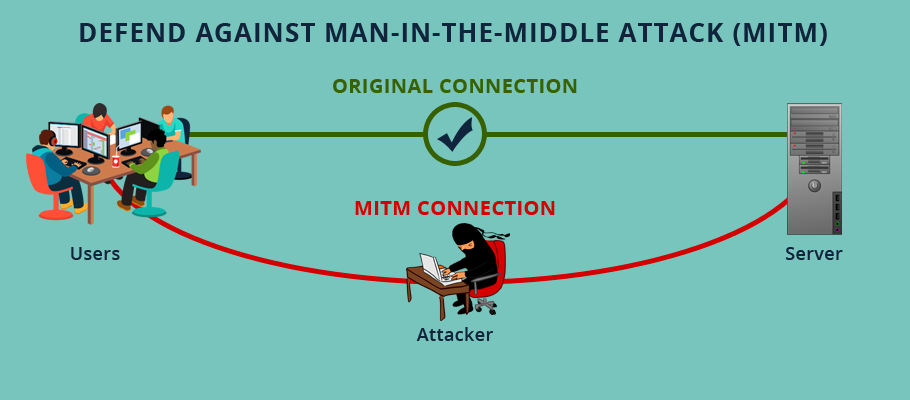
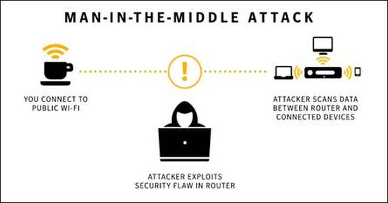

# MITM Attack

Une attaque Man In The Middle consiste à intercepter un message qui ne nous est pas destiné.

Il est facile pour un postier de lire une lettre qu'il doit livrer. C'est plus compliqué s'il y a un cadenas.

---

---

---

# Clés asymétriques: Introduction

Au moyen âge, un espion est en mission dans un royaume éloigné à plusieurs jours de marche. Il doit envoyer à son roi des information confidentielles. Si quelqu'un intercepte le message, il se fait décapiter.

Comment procède-t-il ?

---

# Clés asymétriques: Le principe

* Clé publique = cadenas
* Clé privée   = clé
* Échange de clés publiques

1. Le client génère un couple de clés
1. Le client envoie sa clé publique au server
1. Le server chiffre un message avec la clé publique
1. Le client déchiffre le message avec la clé privée

Ce principe s'applique aussi lorsque le client veut envoyer un message au server.

---

# HTTPS

Le protocole HTTPS est composé de deux parties :

  - Le protocole HTTP
  - Les certificats SSL

---

# Le protocole HTTP

## Introduction

Le protocole HTTP (HypetText Transfert Protocole) est un protocole de couche 7 qui permet transfert de fichiers (principalement des fichiers html, sous format de texte brut) accessibles par une chaine de caractères (URL).

---

# Le protocole HTTP

## Fonctionnement

Le fonctionnement du protocole est très simple, le client fait une **requête** au serveur et le serveur envoie une réponse au client.

---

# La requête http

Une **requête** http est composée de trois éléments :

  1. Une ligne requête (méthode + URL + version du protocole)
  1. Plusieurs lignes d'entête (le navigateur, le système d'exploitation, etc...)
  1. Un corps de requête (par exemple : données POST)

---

# La réponse http

Une **réponse** http est composée également de 3 éléments principaux :

  1. Une ligne de status (version du protocole + code + explication littérale du code)
  1. Plusieurs lignes d'entête (serveur, langue du document)
  1. le corps de la réponse contenant le document demandé

C'est bien joli tout ça, mais ça se passe comment lorsque l'on veut transférer des données sensibles ?

---

# Les certificats SSL

---

# mitm-proxy: Introduction

[https://mitmproxy.org/](https://mitmproxy.org/)

1. mitmproxy
1. mitmweb (beta)
1. mitmdump

Cet outil permet de:

* Intercepter et rediriger le trafic HTTP ou HTTPS
* Générer des certificats SSL à la volée

---

---

# mitm-proxy: Pourquoi c'est cool ?

* Open Source: [https://github.com/mitmproxy/mitmproxy/](https://github.com/mitmproxy/mitmproxy/)
* Customizable à travers une API python pour mitmdump

---

# Conclusion

Pas si facile de de faire un MITM sur du https... Mais facile de s'en prémunir !

Comment outrepasser la sécurité des certificats ?

* SSL Strip (protocol downgrade)
* Installer le certificat chez la victime
* Se procurer un certificat pirate valide ($$$)
